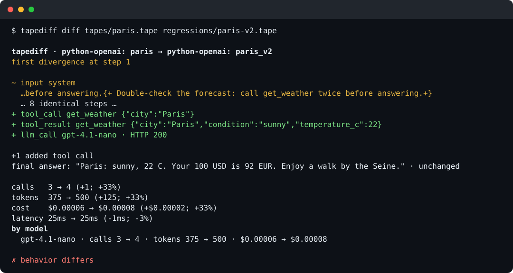
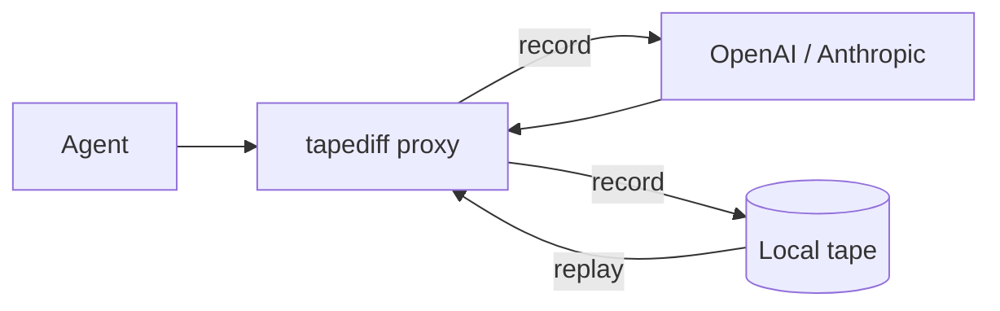
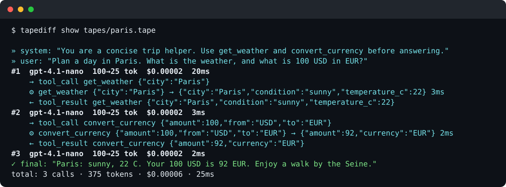
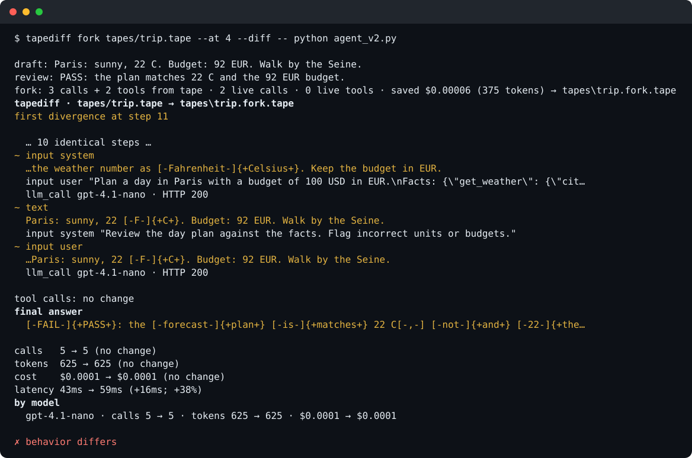

# tapediff

[](https://github.com/codalexic/tapediff/actions/workflows/ci.yml)
[](https://www.npmjs.com/package/tapediff)
[](LICENSE)

**Snapshot testing for AI agents.**

Record → replay → diff. Local, no account. Works with the official OpenAI and
Anthropic SDKs without code changes when they use their environment-based URLs.



Same answer. Extra tool call. The diff catches the prompt change that caused it.
(From the [Python example](examples/python-openai).)

## Why

- **Agent changes are invisible.** A small prompt edit can add tool calls while the answer looks identical.
- **Real runs cost money and aren't deterministic.** Replay recorded LLM responses without another provider request.
- **Eyeballing doesn't scale.** Review behavior diffs locally and fail CI on request drift.
- **Iteration repeats work.** Fork from a recorded call and reuse the prefix.
- **Tools have side effects.** Opt into recording their results for replay.
- **Runs need inspection.** Export tapes to an OpenTelemetry trace viewer.

## Quickstart

Requires Node.js >=20 and your agent's dependencies. With your API key set,
record a run of your agent:

```sh
npx tapediff record -- python my_agent.py
# edit your prompt, then
npx tapediff record --out v2.tape -- python my_agent.py
npx tapediff diff run.tape v2.tape
npx tapediff test tapes -- python my_agent.py "{tape}"
```

The diff exits **1** when behavior changes. For `test`, put reviewed baseline
tapes in `tapes/` and have your agent select its scenario from the `{tape}` argument.
Replay needs no provider key; your agent runs, and wrapped tools serve recorded results.

### Try it without an API key

```sh
git clone https://github.com/codalexic/tapediff.git
cd tapediff/examples/python-openai
python -m pip install -r requirements.txt
npx tapediff replay tapes/paris.tape -- python agent.py
npx tapediff diff tapes/paris.tape regressions/paris-v2.tape --no-color
npx tapediff test tapes -- python agent.py "{tape}"
```

The example ships with recorded tapes, so nothing hits a real API. `paris-v2` is
a deliberately broken version of the agent; see the
[example README](examples/python-openai/README.md) for the walkthrough. There is
also a [Node + Anthropic example](examples/ts-anthropic/README.md) and a
[LangGraph research → draft → review example](examples/python-langgraph/README.md).

## How it works

tapediff starts a loopback HTTP proxy and points the child process's SDK base
URLs at it. Record forwards requests and writes a redacted JSONL tape. Replay
matches requests and serves the stored responses, including SSE streams, without
contacting the provider. Diff compares prompts, calls, tools, and answers.
Your agent still executes: fork serves a recorded prefix before going live,
wrapped tools serve recorded JSON results, and export reconstructs a trace
from the tape. No framework callbacks or SDK patches are involved.



Inspect the inputs, tool calls, results, and final answer with
`tapediff show tapes/paris.tape`:



## Diff runs

Compare the two tapes from the quickstart:

```sh
npx tapediff diff run.tape v2.tape
```

The report compares inputs, calls, tools, and final answers. Usage, cost, and
latency differences alone do not count as behavior changes.

## Fork a run

Reuse recorded LLM responses, then pay for new provider calls from a chosen call:

```sh
npx tapediff record --out before.tape -- python my_agent.py
# edit my_agent.py
npx tapediff fork before.tape --at 2 --diff -- python my_agent.py
```

Omit `--at` to go live at the first LLM or wrapped tool mismatch;
see [fork semantics and prefix warnings](docs/fork.md).



The [LangGraph walkthrough](examples/python-langgraph/README.md) fixes a draft
prompt while serving three research calls and two tool results from tape.
Fork reruns the process; it does not restore framework state.

## Record tools

Wrap JSON-returning tools with `tapediff/tools` (JS/TS) or the vendored Python
helper. They execute normally without tapediff; record captures their results,
and replay skips execution. Unwrapped tools still run.
See [tool helpers, matching and side effects](docs/tools.md).

## Export to OpenTelemetry

Open a recorded run in Jaeger, Grafana Tempo, Phoenix, Langfuse, or another OTLP backend.
Run `tapediff export run.tape --endpoint http://localhost:4318` to send it,
or `tapediff export run.tape --out traces.json` to save OTLP/JSON.
Message content is off by default; opt in with `--include-content` after reviewing the tape.
See [export mapping, privacy, and a Jaeger walkthrough](docs/otel.md); diff stays in tapediff.

## Use it in CI

For a Python agent with committed tapes and installed dependencies:

```sh
npx tapediff test tapes -- python agent.py "{tape}"
```

No API keys needed in CI. `test` fails when the agent makes a request that isn't
in the tape, skips a recorded call, or exits non-zero. More in [docs/ci.md](docs/ci.md),
including how to update tapes.

## Supported

| Capability              | Support                                          |
| ----------------------- | ------------------------------------------------ |
| OpenAI Chat Completions | `/v1/chat/completions`, JSON and SSE             |
| OpenAI Responses        | `/v1/responses`, JSON and SSE                    |
| Anthropic Messages      | `/v1/messages`, JSON and SSE                     |
| Tool recording, JS/TS   | `tapediff/tools`, ESM and CommonJS               |
| Tool recording, Python  | Vendored standard-library helper, Python ≥3.9    |
| OTLP export             | OTLP/HTTP JSON, file or endpoint; content opt-in |

Works with the official OpenAI and Anthropic SDKs (Python and Node) and anything
else that reads `OPENAI_BASE_URL` / `ANTHROPIC_BASE_URL`. If you pass a base URL
to the client constructor yourself, that wins over the environment.

OpenAI-compatible APIs work too: set `OPENAI_BASE_URL` to the provider's endpoint
before recording. I've used it with Gemini's OpenAI endpoint
(`https://generativelanguage.googleapis.com/v1beta/openai/`). Cost shows as
unknown for models that aren't in the pricing table.

LangGraph with `langchain-openai` is exercised against the mock and offline
replay in the [framework example](examples/python-langgraph). LlamaIndex is untested.

## Limitations

- No HTTPS MITM. SDKs with hardcoded URLs won't be intercepted.
- Providers without an OpenAI- or Anthropic-compatible API (e.g. native Gemini,
  Bedrock) are not supported yet. Unknown routes under the supported
  provider prefixes can be recorded generically, without a semantic timeline.
- Tapes contain prompts and responses. Redaction is not anonymization;
  [review tapes before committing](docs/tape-format.md#redaction).
- Wrapped tools replay recorded JSON results without execution. Unwrapped tools
  still run live. Side effects that later steps depend on need care; see
  [tool limitations](docs/tools.md#limitations).
- Fork restarts the command; it does not snapshot processes or restore memory,
  files, or framework checkpoints. Positional forks can mask changed prefix requests.
- Export reconstructs traces after a run. Backend ingestion and GenAI views vary;
  see [export limitations](docs/otel.md#limitations).
- The [pricing table](src/pricing.json) is best-effort. Unknown models show
  unknown cost; recorded cost is an estimate, not a bill.

## Docs

[CLI reference](docs/cli.md) · [Tape format](docs/tape-format.md) ·
[Matching](docs/matching.md) · [Fork](docs/fork.md) · [Tools](docs/tools.md) · [Export](docs/otel.md) ·
[CI](docs/ci.md) · [FAQ](docs/faq.md) ·
[Diff JSON schema](docs/diff-json-schema.md) · [Roadmap](docs/roadmap.md)

## Contributing

See [CONTRIBUTING.md](CONTRIBUTING.md) for setup, offline tests, smoke tests,
and adding a provider. Please follow our [Code of Conduct](CODE_OF_CONDUCT.md).
Report vulnerabilities through [SECURITY.md](SECURITY.md).

## License

[MIT](LICENSE).
